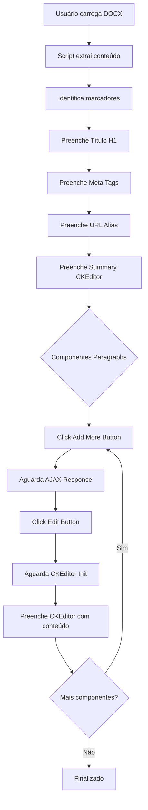
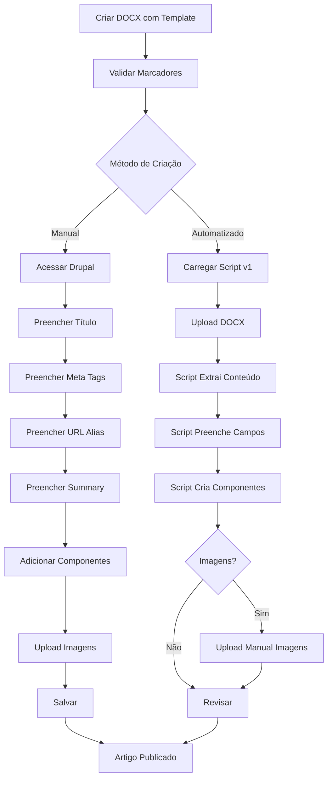

# Processo Completo de Criação de Artigos no Drupal

**Baseado em:** `How do I know if my cat is sick.docx` e `template.docx`

---

## 📋 Visão Geral

Este documento detalha o processo completo de criação de artigos no Drupal usando arquivos DOCX como fonte de conteúdo. O processo pode ser **manual** ou **automatizado** (usando o script `v1`).

---

## 📊 Comparação de Formatos DOCX

Existem **dois formatos** de DOCX identificados no projeto:

### Formato 1: "How do I know if my cat is sick.docx" (Padrão Atual)
- ✅ **Totalmente compatível** com script v1
- Usa marcadores explícitos (`URL:`, `Meta title:`, etc.)
- Estrutura linear e previsível

### Formato 2: "template.docx" (Formato Alternativo)
- ⚠️ **Requer adaptações** no script v1
- Usa marcadores diferentes (`Source:`, `[COMPONENT: ...]`)
- Inclui metadados adicionais (categoria, componentes especiais)

---

## 📄 Estrutura do Template DOCX - Formato Padrão

### Marcadores Obrigatórios

Os arquivos DOCX devem seguir uma estrutura específica com **marcadores de texto** que identificam cada seção:

| Marcador | Descrição | Obrigatório | Exemplo |
|----------|-----------|-------------|---------|
| `URL:` | URL do artigo (pode incluir múltiplos países) | ✅ Sim | `BE: https://www.purina.be/fr/articles/...` |
| `Meta title:` | Título SEO (max 60 caracteres) | ✅ Sim | `Comment savoir si votre chat est malade...` |
| `Meta description:` | Descrição SEO (max 160 caracteres) | ✅ Sim | `Apprenez à reconnaître les signes...` |
| `H1:` | Título principal do artigo | ✅ Sim | `Comment dresser un chat à la laisse` |
| `Intro (H3)` | Introdução/sumário do artigo | ✅ Sim | Primeiro parágrafo resumindo o artigo |
| `Alt-tag:` | Texto alternativo para imagens | ⚠️ Se houver imagens | `Chat allongé sur la table du vétérinaire...` |
| `Text block 1` | Primeiro bloco de conteúdo | ✅ Sim | Conteúdo formatado com headings, listas, etc. |
| `Text block 2` | Segundo bloco de conteúdo | ⚠️ Opcional | Mais conteúdo |
| `Text block 3` | Terceiro bloco de conteúdo | ⚠️ Opcional | FAQ, conclusão, etc. |

### Exemplo Real do DOCX "How do I know if my cat is sick"

```
URL: BE: https://www.purina.be/fr/articles/chats/sante/symptomes/comment-savoir-chat-malade

Meta title: Comment savoir si votre chat est malade : signes courants | Purina

Meta description: Apprenez à reconnaître les signes courants qui indiquent que votre chat est malade...

H1: Comment dresser un chat à la laisse

Comment savoir si mon chat est malade ? 

Alt-tag: Chat allongé sur la table du vétérinaire en train d'être soigné

Intro (H3)
Comparés aux chiens, les chats peuvent paraître des animaux de compagnie indépendants...

Text block 1
Prévenir les maladies courantes du chat
Savoir reconnaître les signes et symptômes d'un chat malade est essentiel...

Signes courants d'un chat malade
Les chats sont passés maîtres dans l'art de cacher la douleur...

Text block 2
Que faire si vous pensez que votre chat est malade
Prise en charge immédiate...

Text block 3
FAQ — Chat malade, maladies du chat (Belgique)
Quels sont les signes d'un chat malade à surveiller ?...
```

---

## 🔄 Processo Completo: Passo a Passo

### Fase 1: Preparação do Conteúdo

#### 1.1. Criar/Editar o DOCX

**Ferramentas:** Microsoft Word, Google Docs, LibreOffice

**Passos:**
1. Abrir `template.docx` ou criar novo documento
2. Seguir a estrutura de marcadores definida acima
3. **Importante:**
   - Usar formatação rich text (negrito, itálico, listas)
   - Incluir headings (H2, H3, H4) para estruturar o conteúdo
   - Não usar estilos personalizados que não sejam padrão
   - Manter hierarquia de headings consistente

#### 1.2. Validar Conteúdo

**Checklist:**
- [ ] Todos os marcadores obrigatórios presentes
- [ ] Meta title < 60 caracteres
- [ ] Meta description < 160 caracteres
- [ ] URL alias definido corretamente
- [ ] Alt-tags para todas as imagens mencionadas
- [ ] Conteúdo formatado corretamente (headings, listas, links)
- [ ] Sem erros ortográficos

---

### Fase 2: Criação Manual no Drupal (Sem Script)

#### 2.1. Acessar Página de Criação

**URL:** `https://[site].pantheonsite.io/[lang]/node/add/nppe_article`

**Exemplo:** `https://live-74999-petcare-purinattt-belgium.pantheonsite.io/fr/node/add/nppe_article`

#### 2.2. Preencher Campos Básicos

| Campo | ID do Campo | Ação |
|-------|-------------|------|
| **Título (H1)** | `edit-title-0-value` | Copiar do marcador `H1:` |
| **Summary (Intro)** | `edit-field-article-summary-0-value` | Copiar do `Intro (H3)` |

**⚠️ Nota:** O campo Summary usa **CKEditor 5**:
- Colar conteúdo diretamente na interface visual
- CKEditor converterá formatação automaticamente

#### 2.3. Preencher Meta Tags

**Localização:** Aba "Meta tags" ou seção "SEO"

| Campo | ID do Campo | Conteúdo DOCX |
|-------|-------------|---------------|
| Meta Title | `edit-field-meta-tags-0-basic-title` | `Meta title:` |
| Meta Description | `edit-field-meta-tags-0-basic-description` | `Meta description:` |
| OG Title | `edit-field-meta-tags-0-open-graph-og-title` | (Geralmente mesmo que Meta Title) |
| OG Description | `edit-field-meta-tags-0-open-graph-og-description` | (Geralmente mesmo que Meta Description) |

#### 2.4. Configurar URL Alias

**Campo:** `edit-path-0-alias`

**⚠️ Importante:**
- Começar com `/` (exemplo: `/articles/chats/sante/symptomes/comment-savoir-chat-malade`)
- Usar formato slug: minúsculas, hífens, sem acentos
- Seguir estrutura do site: `/articles/[categoria]/[subcategoria]/[titulo]`

#### 2.5. Adicionar Componentes Paragraphs

##### **Componente 1: Text (Intro)**

**Ação:**
1. Na seção "Components", clicar no dropdown "Add More"
2. Selecionar **"Add Text"** (`field-article-lp-components-c-text-add-more`)
3. Aguardar AJAX carregar o componente
4. Clicar em **"Modifier"** para expandir
5. Colar conteúdo do `Intro (H3)` no CKEditor
6. (Opcional) Clicar "Collapse" para minimizar

**⚠️ Nota sobre CKEditor:**
- Cada componente Text tem sua própria instância CKEditor
- Formatação (negrito, itálico, headings) deve ser preservada ao colar

##### **Componente 2: Text (Text block 1)**

**Ação:**
1. Clicar novamente no dropdown "Add More"
2. Selecionar **"Add Text"**
3. Aguardar AJAX
4. Clicar "Modifier"
5. Colar conteúdo do `Text block 1`

**Conteúdo Típico:**
- Parágrafos longos de texto
- Subheadings (H2, H3)
- Listas (bullets ou numeradas)
- Links internos/externos

##### **Componente 3: Text + Image (Se houver imagens)**

**Ação:**
1. Clicar "Add More" → **"Add Texte + Image"** (`field-article-lp-components-c-sideimagetext-ttt-add-more`)
2. Clicar "Modifier"
3. Preencher campos:
   - **Heading:** Título da seção
   - **Text Content:** Conteúdo relacionado à imagem
   - **Image:** Clicar "Browse" para abrir Media Library
   - **Image Alignment:** Escolher `left`, `right`, ou `center`
   - **Alt Text:** Copiar do marcador `Alt-tag:` do DOCX

**Upload de Imagem via Media Library:**
1. Clicar "Add media"
2. Upload da imagem
3. Preencher nome e alt-text
4. Salvar e selecionar

##### **Componente 4+: Blocos Adicionais**

Repetir processo para `Text block 2`, `Text block 3`, etc.

**Tipos de Componentes Comuns:**
- **Text**: Conteúdo padrão
- **Text + Image**: Seções ilustradas
- **Accordion**: FAQs (se `Text block 3` for FAQ)
- **Products List**: Recomendações de produtos

#### 2.6. Ordenar Componentes

**Método 1: Drag & Drop**
1. Clicar botão "Drag & drop" no topo da tabela de componentes
2. Arrastar componentes para reordenar
3. Desabilitar modo drag & drop

**Método 2: Weight**
1. Clicar "Show row weights"
2. Ajustar valores de weight (menor = mais acima)

#### 2.7. Salvar e Publicar

**Opções:**
- **Save as Draft:** Salvar sem publicar
- **Save and Publish:** Publicar imediatamente
- **Save and Request Review:** Enviar para revisão editorial

---

### Fase 3: Criação Automatizada com Script v1

#### 3.1. Preparar Script v1

**Localização:** `c:\Users\BRBritoCa1\OneDrive - NESTLE\Codes\drupal-content-upload\v1`

**Tipo:** Bookmarklet JavaScript

**O que o script faz:**
1. Lê arquivo DOCX e extrai conteúdo
2. Identifica marcadores (`URL:`, `Meta title:`, etc.)
3. Mapeia conteúdo para campos Drupal
4. Preenche formulário automaticamente via DOM manipulation
5. Gerencia criação de componentes Paragraphs via AJAX
6. Insere conteúdo em instâncias CKEditor

#### 3.2. Modelos de Mapeamento (MODELS)

O script `v1` usa **modelos pré-definidos** que mapeiam campos:

```javascript
const MODELS = {
  "BE-Articles": {
    "createdAt": "2025-09-10T19:32:22.632Z",
    "url": "https://live-74999-petcare-purinattt-belgium.pantheonsite.io/fr/node/10633/edit",
    "items": [
      {
        "id": "au0xkohly4fmfbgf81j",
        "field": {
          "name": "field_article_lp_components[0][subform][field_c_text][0][value]",
          "id": "edit-field-article-lp-components-0-subform-field-c-text-0-value",
          "editor": "ckeditor"
        },
        "note": "Intro, must be h3"
      },
      {
        "id": "444hxgnavqxmfbgfaym",
        "field": {
          "name": "field_article_lp_components[1][subform][field_c_text][0][value]",
          "editor": "ckeditor"
        },
        "note": "First text block"
      }
      // ... mais componentes
    ]
  }
}
```

#### 3.3. Workflow do Script v1

**Passo a Passo Automatizado:**



#### 3.4. Detalhes Técnicos do Script

##### **3.4.1. Extração de Conteúdo DOCX**

```javascript
// Função extractByMarkers
function extractByMarkers(html) {
  const markers = {
    'URL:': 'url',
    'Meta title:': 'metaTitle',
    'Meta description:': 'metaDescription',
    'H1:': 'title',
    'Intro (H3)': 'intro',
    'Text block 1': 'textBlock1',
    'Text block 2': 'textBlock2',
    'Text block 3': 'textBlock3',
    'Alt-tag:': 'altTag'
  };
  
  // Processa HTML e extrai seções baseadas nos marcadores
  // Retorna objeto com conteúdo estruturado
}
```

##### **3.4.2. Preenchimento de Campos Simples**

```javascript
// Título
document.querySelector('#edit-title-0-value').value = parsed.title;

// Meta Title
document.querySelector('#edit-field-meta-tags-0-basic-title').value = parsed.metaTitle;

// Meta Description
document.querySelector('#edit-field-meta-tags-0-basic-description').value = parsed.metaDescription;

// URL Alias
document.querySelector('#edit-path-0-alias').value = parsed.url;
```

##### **3.4.3. Preenchimento CKEditor**

```javascript
// Article Summary
const summaryEditor = document.querySelector('[data-drupal-selector="edit-field-article-summary-0-value"]');
if (summaryEditor && summaryEditor.ckeditorInstance) {
  summaryEditor.ckeditorInstance.setData(parsed.intro);
}
```

##### **3.4.4. Criação Dinâmica de Paragraphs**

```javascript
async function addParagraphComponent(type, content) {
  // 1. Click Add More button
  const addBtn = document.querySelector(`#field-article-lp-components-${type}-add-more`);
  addBtn.click();
  
  // 2. Aguarda AJAX callback
  await waitForAjax();
  
  // 3. Identifica novo componente (último índice)
  const index = getLatestComponentIndex();
  
  // 4. Click Edit button
  const editBtn = document.querySelector(`#field-article-lp-components-${index}-edit--2`);
  editBtn.click();
  
  // 5. Aguarda formulário expandir
  await waitForFormExpansion(index);
  
  // 6. Preenche CKEditor
  const editorSelector = `[name="field_article_lp_components[${index}][subform][field_c_text][0][value]"]`;
  const editor = document.querySelector(editorSelector);
  
  if (editor && editor.ckeditorInstance) {
    editor.ckeditorInstance.setData(content);
  }
}

// Uso
await addParagraphComponent('c-text', parsed.intro);
await addParagraphComponent('c-text', parsed.textBlock1);
await addParagraphComponent('c-sideimagetext-ttt', parsed.textBlock2WithImage);
```

#### 3.5. Mapeamento DOCX → Drupal

| DOCX Marker | Script Field | Drupal Field ID | Componente Drupal |
|-------------|--------------|-----------------|-------------------|
| `H1:` | `parsed.title` | `edit-title-0-value` | Title (input) |
| `Meta title:` | `parsed.metaTitle` | `edit-field-meta-tags-0-basic-title` | Meta Tag (input) |
| `Meta description:` | `parsed.metaDescription` | `edit-field-meta-tags-0-basic-description` | Meta Tag (textarea) |
| `URL:` | `parsed.url` | `edit-path-0-alias` | URL Alias (input) |
| `Intro (H3)` | `parsed.intro` | `edit-field-article-summary-0-value` | Summary (CKEditor) |
| `Text block 1` | `parsed.textBlock1` | `field_article_lp_components[0]` | Paragraph: Text (CKEditor) |
| `Text block 2` | `parsed.textBlock2` | `field_article_lp_components[1]` | Paragraph: Text (CKEditor) |
| `Text block 3` | `parsed.textBlock3` | `field_article_lp_components[2]` | Paragraph: Text ou Accordion |
| `Alt-tag:` | `parsed.altTag` | Media field dentro de Paragraph | Paragraph: Image Alt |

---

## 🔍 Exemplo Completo: "How do I know if my cat is sick"

### DOCX Original → Drupal Final

#### Mapeamento Passo a Passo

**1. Título**
- DOCX: `H1: Comment dresser un chat à la laisse`
- Drupal: Campo `edit-title-0-value` = `"Comment dresser un chat à la laisse"`

**2. Meta Tags**
- DOCX: `Meta title: Comment savoir si votre chat est malade : signes courants | Purina`
- Drupal: `edit-field-meta-tags-0-basic-title` = `"Comment savoir si votre chat est malade : signes courants | Purina"`

**3. URL Alias**
- DOCX: `URL: BE: https://www.purina.be/fr/articles/chats/sante/symptomes/comment-savoir-chat-malade`
- Drupal: `edit-path-0-alias` = `"/articles/chats/sante/symptomes/comment-savoir-chat-malade"`

**4. Intro/Summary**
- DOCX: Conteúdo após `Intro (H3)`
- Drupal: CKEditor em `edit-field-article-summary-0-value`

**5. Componentes (8 total no exemplo preenchido)**

| # | Tipo | Conteúdo DOCX | Drupal Component |
|---|------|---------------|------------------|
| 0 | Text | Intro (H3) | `field_article_lp_components[0]` type: `c_text` |
| 1 | Text | Início do Text block 1 | `field_article_lp_components[1]` type: `c_text` |
| 2 | Text + Image | Seção com imagem sobre sintomas | `field_article_lp_components[2]` type: `c_sideimagetext_ttt` |
| 3 | Text | Continuação Text block 1 | `field_article_lp_components[3]` type: `c_text` |
| 4 | Text + Image | Seção com imagem sobre prevenção | `field_article_lp_components[4]` type: `c_sideimagetext_ttt` |
| 5 | Text | Text block 2 | `field_article_lp_components[5]` type: `c_text` |
| 6 | Products List | Produtos recomendados | `field_article_lp_components[6]` type: `c_products_list` |
| 7 | Text | Text block 3 (FAQ) | `field_article_lp_components[7]` type: `c_text` |

---

## ⚠️ Desafios e Soluções

### 1. AJAX Assíncrono

**Problema:** Componentes são carregados via AJAX, não estão imediatamente disponíveis no DOM.

**Solução:**
```javascript
function waitForAjax(timeout = 5000) {
  return new Promise((resolve, reject) => {
    const startTime = Date.now();
    const checkAjax = () => {
      if (typeof Drupal !== 'undefined' && 
          Drupal.ajax && 
          Object.keys(Drupal.ajax.instances).every(key => !Drupal.ajax.instances[key].ajaxing)) {
        resolve();
      } else if (Date.now() - startTime > timeout) {
        reject(new Error('AJAX timeout'));
      } else {
        setTimeout(checkAjax, 100);
      }
    };
    checkAjax();
  });
}
```

### 2. CKEditor Inicialização Dinâmica

**Problema:** Instâncias CKEditor são criadas assincronamente após AJAX.

**Solução:**
```javascript
function waitForCKEditor(selector, timeout = 5000) {
  return new Promise((resolve, reject) => {
    const startTime = Date.now();
    const checkEditor = () => {
      const element = document.querySelector(selector);
      if (element && element.ckeditorInstance && element.ckeditorInstance.isReady) {
        resolve(element.ckeditorInstance);
      } else if (Date.now() - startTime > timeout) {
        reject(new Error('CKEditor timeout'));
      } else {
        setTimeout(checkEditor, 100);
      }
    };
    checkEditor();
  });
}
```

### 3. Identificação de Novo Componente

**Problema:** Após clicar "Add More", como saber qual é o índice do novo componente?

**Solução:**
```javascript
function getLatestComponentIndex() {
  const components = document.querySelectorAll('[id^="field-article-lp-components-"][id$="-item-wrapper"]');
  const indices = Array.from(components).map(el => {
    const match = el.id.match(/field-article-lp-components-(\d+)-item-wrapper/);
    return match ? parseInt(match[1]) : -1;
  });
  return Math.max(...indices);
}
```

### 4. Media Library para Imagens

**Problema:** Upload de imagens requer interação com Media Library modal.

**Solução:**
- Script pode automatizar clique em "Browse"
- Upload real ainda precisa de interação manual (limitação de segurança do browser)
- **Alternativa:** Pré-upload de imagens na Media Library, script apenas seleciona

---

## 📊 Diagrama de Fluxo Completo



---

## 🛠️ Troubleshooting

### Problema: "Campo X não encontrado"

**Causa:** Seletor CSS incorreto ou campo não visível.

**Solução:**
1. Verificar se campo existe no HTML: `document.querySelector('#SELECTOR')`
2. Verificar se campo está em aba oculta (clicar para expandir)
3. Verificar se `data-drupal-selector` mudou

### Problema: "CKEditor não inicializa"

**Causa:** Instância não criada ou ainda em loading.

**Solução:**
1. Aguardar mais tempo
2. Verificar se textarea tem `data-ckeditor5-id`
3. Verificar `element.ckeditorInstance` existe

### Problema: "Componente não adicionado"

**Causa:** AJAX não completou antes de tentar acessar componente.

**Solução:**
1. Aumentar timeout de espera AJAX
2. Verificar se botão "Add More" foi clicado
3. Verificar console para erros Drupal

---

## ✅ Checklist Final

Antes de publicar artigo:

- [ ] Título (H1) preenchido
- [ ] Meta title < 60 caracteres
- [ ] Meta description < 160 caracteres
- [ ] URL alias segue padrão do site
- [ ] Summary/Intro presente
- [ ] Todos os componentes adicionados
- [ ] Imagens uploaded com alt-text
- [ ] Formatação (headings, listas) preservada
- [ ] Links funcionando
- [ ] Preview do artigo revisado
- [ ] Categoria/tags aplicadas
- [ ] Estado de publicação correto (draft/published)

---

## 📚 Referências

- [drupal_field_mapping.md](file:///C:/Users/BRBritoCa1/.gemini/antigravity/brain/df2d5fd9-6b27-45d6-a4f1-7643afef4cd3/drupal_field_mapping.md): Mapeamento detalhado de campos Drupal
- [paragraph_components_analysis.md](file:///C:/Users/BRBritoCa1/.gemini/antigravity/brain/df2d5fd9-6b27-45d6-a4f1-7643afef4cd3/paragraph_components_analysis.md): Análise de componentes Paragraphs
- [template_docx_analysis.md](file:///C:/Users/BRBritoCa1/.gemini/antigravity/brain/df2d5fd9-6b27-45d6-a4f1-7643afef4cd3/template_docx_analysis.md): **Análise do formato alternativo template.docx e modificações necessárias para v1**
- [v1](file:///c:/Users/BRBritoCa1/OneDrive%20-%20NESTLE/Codes/drupal-content-upload/v1): Script de automação
- [How do I know if my cat is sick.docx](file:///c:/Users/BRBritoCa1/OneDrive%20-%20NESTLE/Codes/drupal-content-upload/How%20do%20I%20know%20if%20my%20cat%20is%20sick.docx): Exemplo de DOCX formatado (padrão)
- [template.docx](file:///c:/Users/BRBritoCa1/OneDrive%20-%20NESTLE/Codes/drupal-content-upload/template.docx): Template alternativo (requer adaptações)

---

**Última atualização:** 2025-12-01
